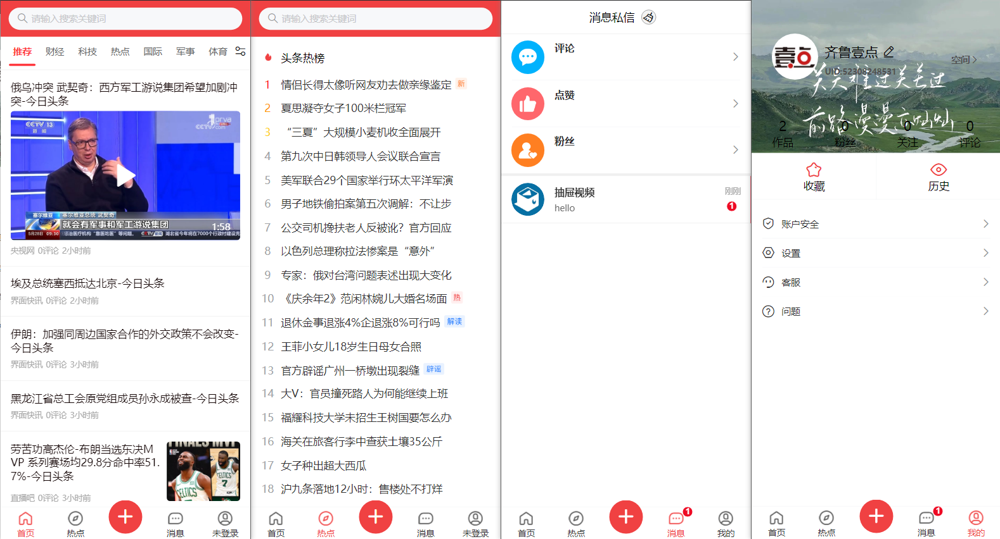
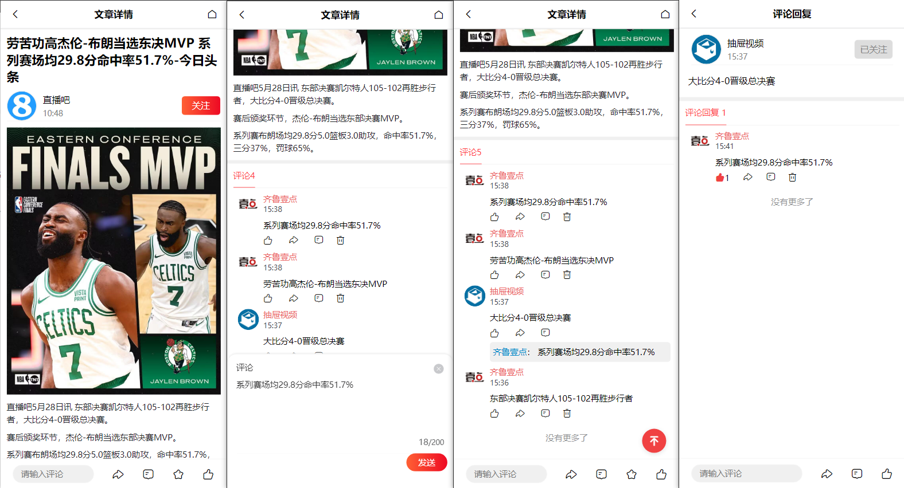
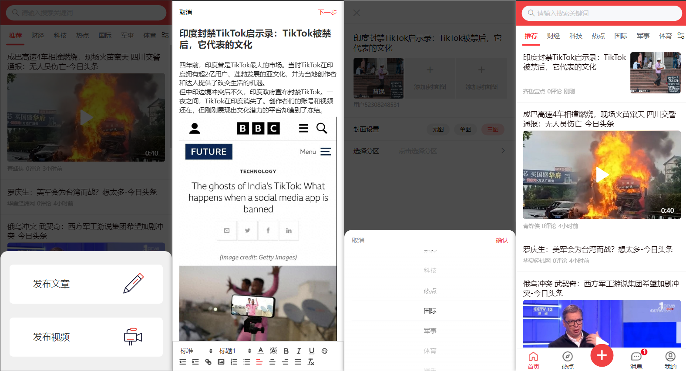
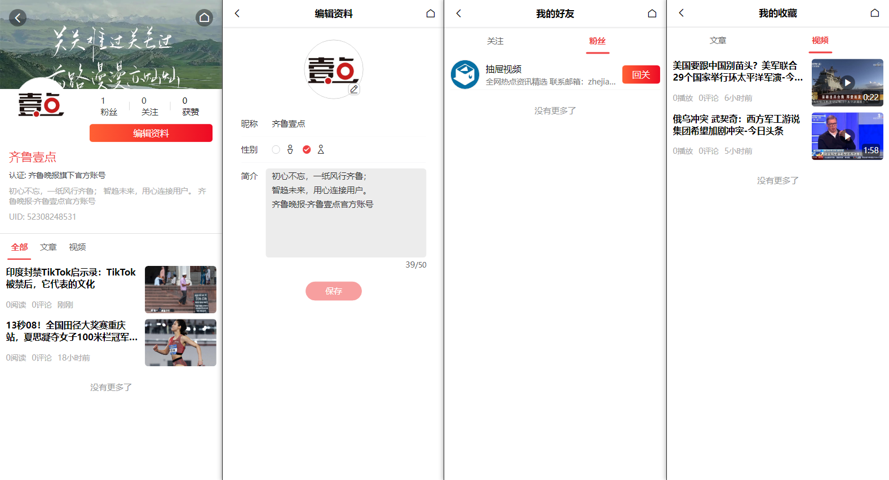
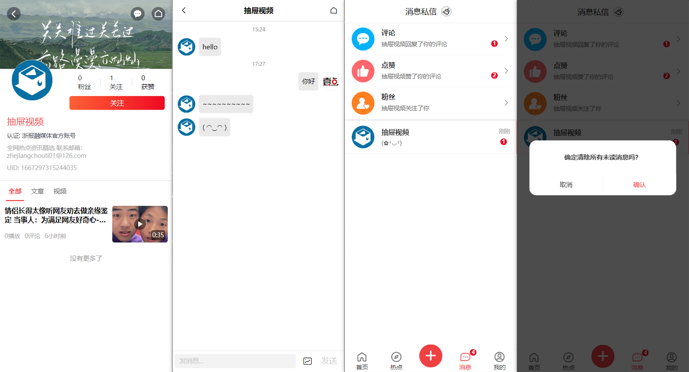

# 基于 vue3 和 Vite 构建的新闻资讯类应用移动端

## 介绍

该项目是基于 vue3 和 Vite 构建的一个移动端的新闻资讯类应用，实现登录注册、浏览新闻、浏览热点、观看视频、评论、收藏、点赞、关注用户、发布文章、发布视频、用户对话、实时消息通知等功能。

## 项目运行

1. 克隆或下载项目

2. 安装依赖

   ```
   pnpm install
   ```

3. 后端接口：https://github.com/HZhertz-JXjrtyx/Vue3-TT-news-api

4. 运行项目

   ```
   pnpm run dev
   ```

5. 项目打包

   ```
   pnpm run build
   ```


## 技术栈

- vite：使用 vite 进行构建与打包
- eslint：使用 eslint + prettier 进行代码规范检查
- husky：使用 husky + lint-staged 进行代码提交校验
- vant：使用 vant 组件库
- postcss-px-to-viewport：使用 postcss-px-to-viewport 转换单位，实现移动端适配
- vue-router：路由管理
- pinia：全局状态管理，使用 pinia-plugin-persistedstate 做持久化
- axios：ajax 请求
- websocket：使用 socket.io-client 进行 websocket 的连接，实现实时消息接收
- vuedraggable：使用 vuedraggable 拖拽库，实现新闻频道拖拽编辑
- plyr：使用 plyr 视频播放器组件库
- quill：使用 quill 富文本编辑器
- lordicon：使用 lordicon 动态图标

## 效果图

### Tab 项



### 文章与评论



### 发布相关



### 用户相关



### 消息相关



